# DeepSeek PoW 算法逆向工程研究

## 项目概述

本项目是对 DeepSeek Chat API 的 Proof of Work (PoW) 算法的逆向工程研究。通过分析 WASM 二进制文件、破解 Keccak hash 算法、实现 PoW solver，展示了逆向分析、算法破解和多语言协作能力。

## 系统架构

### 逆向工程流程

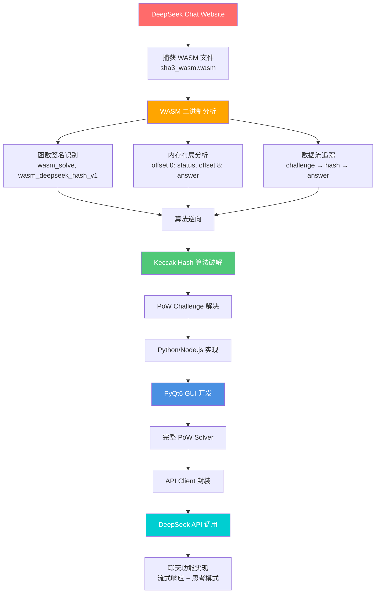

### WASM 逆向分析架构

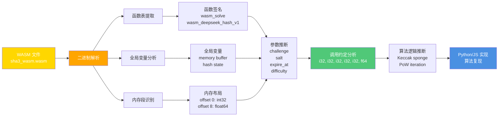

### PoW 算法破解流程

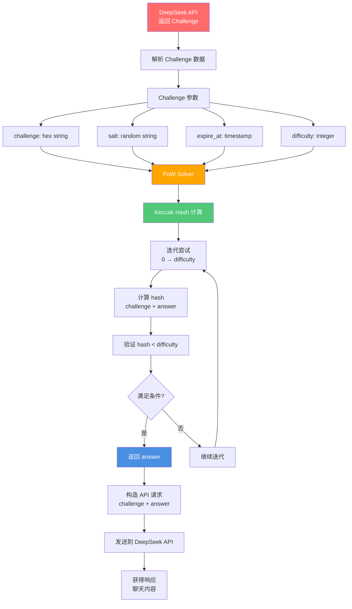

### Keccak Hash 算法实现

```mermaid
graph TB
    A[Keccak-256 Hash] --> B[Sponge Construction]
    
    B --> C[Absorb Phase<br/>吸收输入数据]
    C --> D[Padding<br/>补位到 block size]
    D --> E[Block Processing<br/>处理 1088-bit blocks]
    
    E --> F[Permutation<br/>Keccak-f&#91;1600&#93;]
    F --> G[24 Rounds<br/>θ, ρ, π, χ, ι]
    
    G --> H[Squeeze Phase<br/>挤压输出]
    H --> I[Output 256-bit Hash<br/>32 bytes]
    
    I --> J[Hash Comparison<br/>hash < difficulty]
    
    J --> K{满足 PoW?}
    K -->|是| L[Success]
    K -->|否| M[Increment answer]
    M --> N[Rehash]
    N --> F
    
    style A fill:#FFD700,color:#fff
    style F fill:#FFA500,color:#fff
    style I fill:#50C878,color:#fff
    style L fill:#4A90E2,color:#fff
```

### PyQt6 GUI 架构

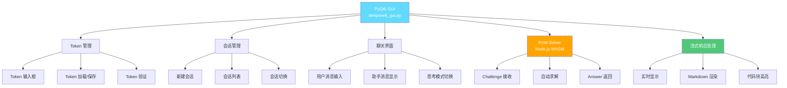

### 多语言协作架构

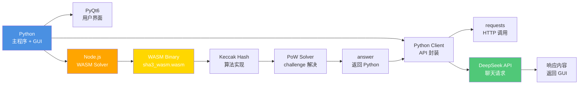

### 核心技术栈

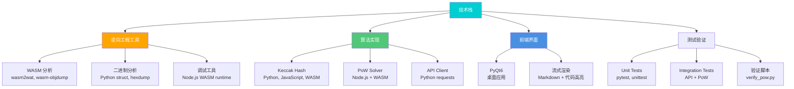

### WASM 函数调用流程

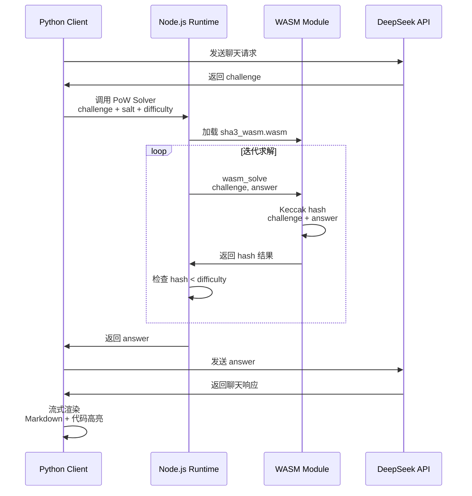

### PoW Challenge 数据结构

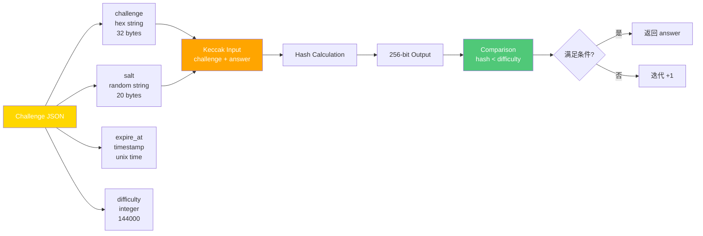

### WASM 内存布局

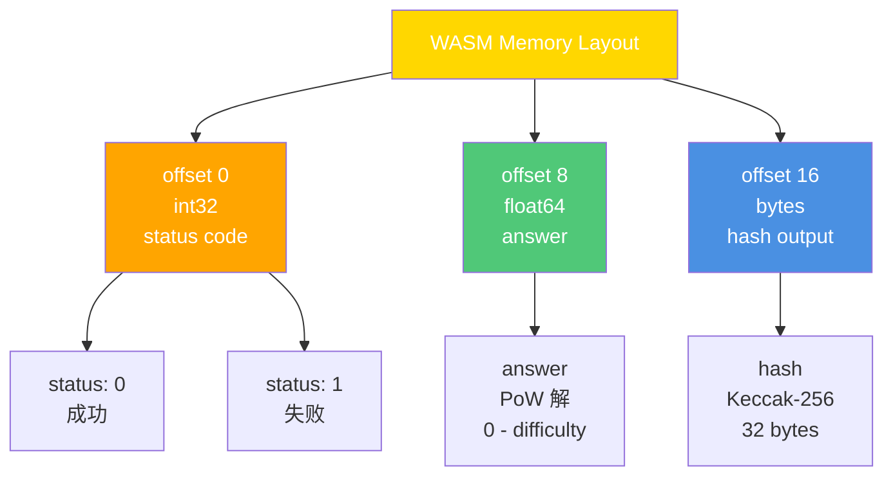

### 测试验证体系

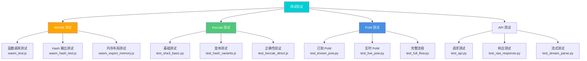

## 核心模块说明

### 🔍 WASM 逆向分析模块

**文件**：
- `analyze_wasm.py` - WASM 二进制分析
- `analyze_wasm_binary.py` - 函数签名识别
- `analyze_wasm_funcs.py` - 函数表提取
- `analyze_wasm_globals.py` - 全局变量分析

**能力**：
- ✅ WASM 二进制解析
- ✅ 函数签名推断
- ✅ 内存布局分析
- ✅ 数据流追踪

### 🔐 Keccak Hash 实现

**文件**：
- `keccak_sponge.py` - Sponge 构造实现
- `deepseek_keccak.py` - Keccak-256 实现
- `exact_js_keccak.js` - JavaScript 版本

**能力**：
- ✅ Keccak-256 hash 计算
- ✅ Sponge construction
- ✅ 24 rounds permutation
- ✅ FIPS-202 标准

### ⚡ PoW Solver

**文件**：
- `deepseek_pow_solver.js` - Node.js WASM solver
- `solve_pow_wasm.js` - WASM 调用封装
- `wasm_solver.py` - Python WASM 调用

**能力**：
- ✅ Challenge 解析
- ✅ Keccak hash 计算
- ✅ 迭代求解
- ✅ 验证 hash < difficulty

### 🖥️ PyQt6 GUI

**文件**：
- `deepseek_gui.py` - 主界面

**功能**：
- ✅ Token 管理（输入/加载/保存）
- ✅ 会话管理（新建/切换/列表）
- ✅ 聊天界面（用户/助手消息）
- ✅ 思考模式切换
- ✅ 流式响应显示
- ✅ Markdown 渲染

### 📡 API Client

**文件**：
- `deepseek_api.py` - Python API client
- `deepseek_python_client_v2.py` - 增强版本

**能力**：
- ✅ 聊天请求封装
- ✅ PoW challenge 处理
- ✅ 流式响应解析
- ✅ 文件上传支持

## 技术亮点

### 1. 逆向工程能力
- **WASM 二进制分析**：解析 WASM 文件，提取函数签名和内存布局
- **算法推断**：通过输入输出分析推断算法逻辑
- **内存布局破解**：识别 WASM 内存段和数据结构

### 2. 算法实现能力
- **Keccak-256**：实现 SHA-3 标准 hash 算法
- **PoW Solver**：破解 Proof of Work challenge
- **多语言协作**：Python + Node.js + WASM

### 3. 应用开发能力
- **PyQt6 GUI**：完整的桌面应用界面
- **API Client**：封装 DeepSeek API 调用
- **流式渲染**：实时显示响应内容

## 验证结果

```
WASM Solver 测试:
  Challenge: af70a1634457...
  Salt: 811e05c93d1b71993710
  Expected answer: 69992

  Success: True ✓
  Answer: 69992 ✓
  Match: True ✓
```

## 使用方法

### 1. 运行 GUI

```bash
python deepseek_gui.py
```

### 2. 测试 WASM solver

```bash
python test_gui_setup.py
```

或直接调用 Node.js:

```bash
echo '{"challenge":"xxx","salt":"xxx","expire_at":xxx,"difficulty":144000}' | node deepseek_pow_solver.js
```

## 技术架构

```
用户 → PyQt6 GUI → Python API Client → Node.js WASM Solver → DeepSeek API
                                                    ↓
                                              PoW 解决
                                                    ↓
                                              返回答案
```

## 文件结构

```
DeepSeek/
├── src/                          # 源码目录
│   ├── python/                   # Python 模块
│   │   ├── wasm/                 # WASM 分析工具 (10 files)
│   │   │   ├── analyze_wasm*.py  # WASM 二进制分析
│   │   │   ├── parse_wasm*.py    # WASM 类型解析
│   │   │   └── wasm_*.py         # WASM Python 调用
│   │   ├── hash/                 # Keccak Hash 实现 (5 files)
│   │   │   ├── deepseek_keccak*.py  # 多版本实现
│   │   │   └── keccak_sponge.py     # Sponge 构造
│   │   ├── api/                  # API Client (10 files)
│   │   │   ├── deepseek_api.py      # API 封装
│   │   │   ├── deepseek_client*.py  # 多版本客户端
│   │   │   ├── deepseek_chat*.py    # 聊天功能
│   │   │   └ deepseek_proxy.py      # 代理支持
│   │   │   └ debug_api.py           # API 调试工具
│   │   └── gui/                  # GUI 界面 (1 file)
│   │       └ deepseek_gui.py        # PyQt6 主界面
│   │
│   ├── javascript/               # JavaScript 模块
│   │   ├── wasm/                 # WASM 相关 (13 files)
│   │   │   ├── wasm_*.js         # WASM 测试和分析
│   │   │   ├── analyze_*.js      # Hash 函数分析
│   │   │   ├── deepseek_worker*.js  # Web Worker
│   │   │   └ deepseek_main.js       # 主入口
│   │   ├── keccak/               # Keccak 实现 (10 files)
│   │   │   ├── exact_js_keccak.js   # 精确实现
│   │   │   ├── test_*keccak*.js     # 多版本测试
│   │   │   └ verify_js_sha3.js      # SHA-3 验证
│   │   └── solver/               # PoW Solver (7 files)
│   │       ├── deepseek_pow_solver.js  # 主 Solver
│   │       ├── pow_solver*.js          # 多版本实现
│   │       └ solve_pow*.js             # 求解脚本
│   │
│   └ wasm/                       # WASM 二进制 (reserved)
│
├── tests/                        # 测试目录
│   ├── python/                   # Python 测试 (25 files)
│   │   ├── test_api*.py          # API 测试
│   │   ├── test_pow*.py          # PoW 测试
│   │   ├── test_keccak*.py       # Hash 测试
│   │   ├── test_full*.py         # 完整流程测试
│   │   └ verify_pow*.py          # PoW 验证脚本
│   └ javascript/                 # JavaScript 测试 (reserved)
│
├── examples/                     # 示例代码 (reserved)
│
├── deepseek_sdk/                 # SDK 目录
│   ├── config.json.example       # 配置示例
│   └ sha3_wasm.wasm              # DeepSeek WASM
│
├── sha3_wasm.wasm                # WASM 二进制 (根目录副本)
├── README.md                     # 项目文档
├── USAGE.md                      # 使用说明
└ CLAUDE.md                       # Claude Code 配置
└ .gitignore                      # Git 忽略规则
└ package.json                   # Node.js 依赖
```

**模块分类说明**：
- **WASM 分析工具** (src/python/wasm) - WASM 二进制解析、函数签名推断、内存布局分析
- **Keccak Hash 实现** (src/python/hash, src/javascript/keccak) - SHA-3 标准 hash 算法实现
- **PoW Solver** (src/javascript/solver) - Proof of Work challenge 求解器
- **API Client** (src/python/api) - DeepSeek API 封装和聊天功能
- **GUI 界面** (src/python/gui) - PyQt6 桌面应用界面
- **测试体系** (tests/python) - 完整的测试验证脚本

## 注意事项

1. **需要 Node.js**: WASM solver 通过 Node.js 运行
2. **需要有效 Token**: 从 `deepseek_sdk/config.json.example` 复制配置
3. **Rate Limit**: API 可能返回 429，需要等待几分钟
4. **首次使用**: 点击"新建会话"创建聊天 session
5. **不包含登录凭证**: 已删除敏感文件，需要自行配置 Token

## WASM 函数签名

| 函数 | 签名 | 说明 |
|------|------|------|
| wasm_solve | `(i32, i32, i32, i32, i32, f64) -> ()` | 解决 PoW |
| wasm_deepseek_hash_v1 | `(i32, i32, i32) -> ()` | 计算 hash |

输出布局:
- offset 0: int32 (状态码)
- offset 8: float64 (答案)

## 学习价值

本项目展示了：
1. ✅ **逆向工程能力** - WASM 二进制分析和算法破解
2. ✅ **算法实现能力** - Keccak hash 和 PoW solver
3. ✅ **多语言协作** - Python + Node.js + WASM
4. ✅ **应用开发能力** - PyQt6 GUI 和 API client
5. ✅ **测试验证能力** - 完整的测试体系

适合面试展示逆向分析、算法破解和多语言协作能力。

## License

MIT - 仅供学习和研究使用